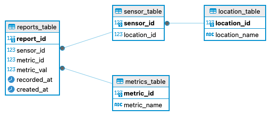
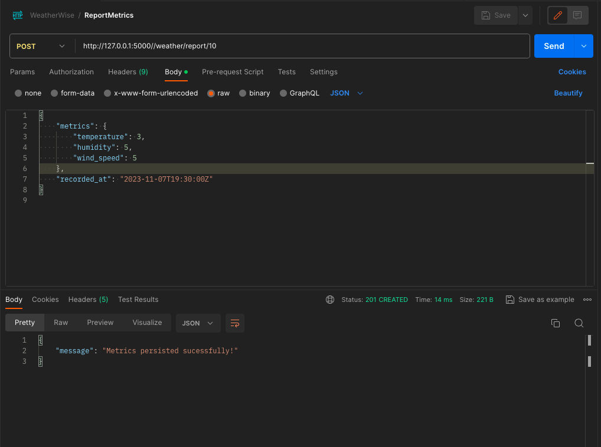
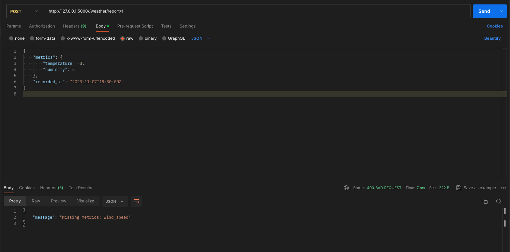
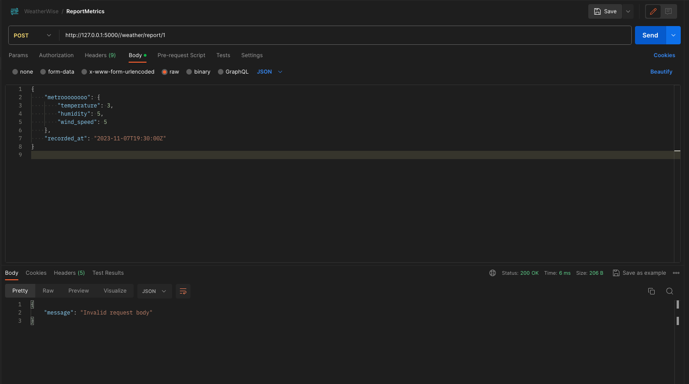
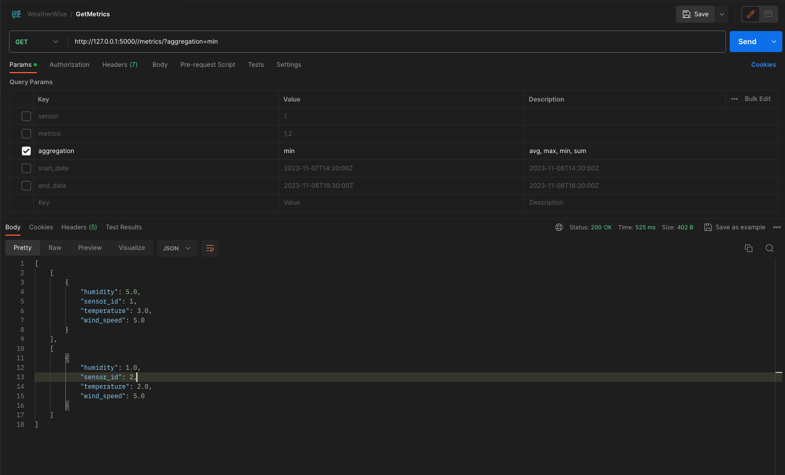
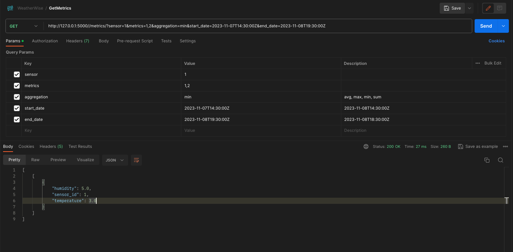
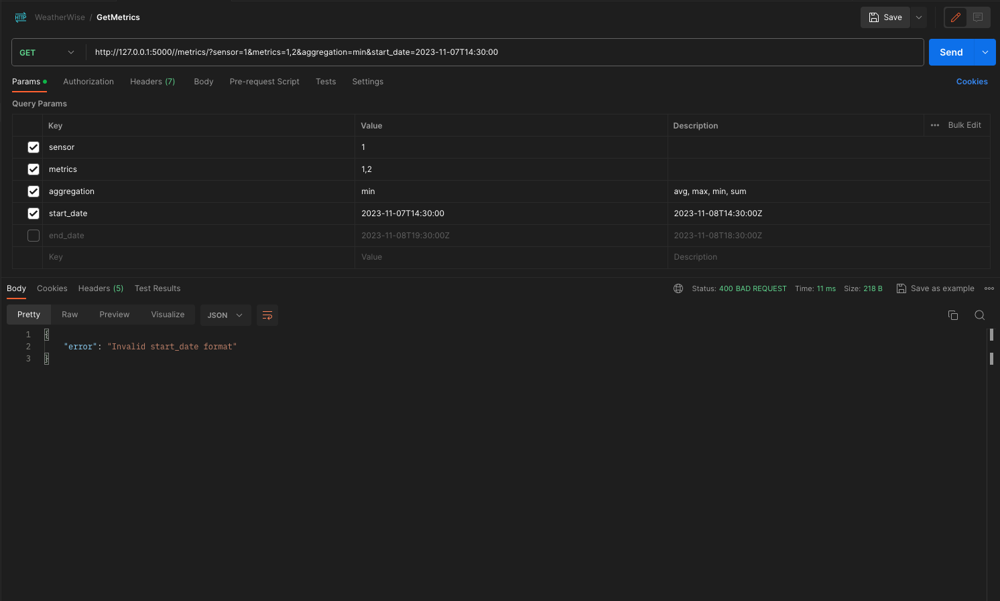

# WeatherWise

This project provides an API for reporting, retrieving, and aggregating weather-related metrics from sensors. It's built with Flask and includes functionalities to report metrics, retrieve aggregated data.

## Table of Contents
- [Getting Started](#getting-started)
- [Endpoints](#endpoints)
- [API Usage](#api-usage)
- [Database Schema](#database-schema)
- [Screenshots](#screenshots)
- [API Reference](#api-reference)
- [Configuration](#configuration)

## Getting Started
To get started with this Weather Metrics API, follow these steps:
1. Clone the repository to your local machine:
    ```bash
    git clone https://github.com/sahilsangani98/weather-metrics-api.git
    ```
2. Ensure you have Python installed and set up a virtual environment. (Or Use provided env)
3. Make sure you have PostgreSQL Server up with Database named `weatherdb` and access to `postgres` user with password `1234`
4. Once you have database available you need to create necessory schema and tables for the application with some dummy data by running:
    ```bash
    bash db_setup_with_data.sh
    ```    
3. Install the required dependencies listed in the `requirements.txt` file.
4. Start the application by running:
    ```bash
    pip install requirments.txt
    bash start.sh
    ```
    
## Endpoints
### Reporting Weather Metrics
- **POST /weather/report/<int:sensor_id>**:
  - Endpoint for reporting weather metrics from a sensor.
  - Validates the sensor ID and incoming data using a schema.
  - Supports reporting and validation for various weather metrics.

## Retrieving Aggregated Metrics
- **GET /metrics/**:
  - Endpoint to retrieve aggregated weather metrics.
  - Accepts sensor names, metrics, aggregation, start, and end dates as query parameters.
  - Performs validations for the query parameters and formats the aggregated metrics data.
  
## API Usage

Once the application is running, you can use it to shorten URLs via the API. Here's an example of how to shorten a URL using cURL:

### GET Request

```bash
curl --location 'http://127.0.0.1:5000//metrics/?sensor=1&metrics=1%2C2&aggregation=min&start_date=2023-11-07T14%3A30%3A00Z&end_date=2023-11-08T19%3A30%3A00Z'
```

### POST Request
```bash
curl --location 'http://127.0.0.1:5000//weather/report/1' \
--header 'Content-Type: application/json' \
--data '{
    "metrics": {
        "temperature": 3,
        "humidity": 5,
        "wind_speed": 5
    },
    "recorded_at": "2023-11-07T19:30:00Z"
}'
```

## Database Schema
<!-- Database schema -->



## Screenshots
<!-- Post Request Success -->


<!-- Post Request Fail - Missing metric value -->


<!-- Post Request - Invalid body -->


<!-- Get Request - Valid with Single Param -->


<!-- Get Request - Valid with multiple Param -->


<!-- Get Request - Invalid Date format -->



## API Reference
The API includes the following key functions:
- **Reporting Metrics**: Provides an endpoint for reporting sensor metrics with validation and error handling.
- **Retrieving Aggregated Data**: Offers an endpoint for retrieving aggregated metrics based on query parameters.

## Configuration
This Weather Metrics API uses Flask and Python and can be configured by modifying certain parameters:
- **Environment Variables**: Ensure necessary environment variables are set for the proper functioning of the application.
- **Data Handling**: The API handles incoming and outgoing data using specific schemas and validation methods.

### Dependencies
- Python 3.x
- Flask
- JSON
- datetime
- threading
- request
- jsonify

Feel free to reach out for further details on how to configure or use this API for weather metric management.
